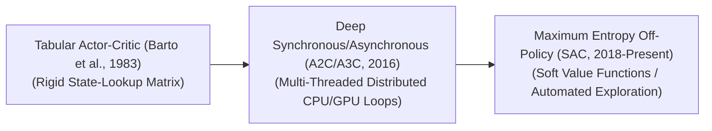

# Awesome-Actor-Critic-Architectures

  

  

        
  

  
<strong>A curated repository exploring the evolution, variants, processing layouts, safety mitigations, and real-world frontier applications of Actor-Critic frameworks in Deep Reinforcement Learning.</strong>

---

## 📖 Introduction

Actor-Critic architectures represent a cornerstone paradigm in Reinforcement Learning (RL), elegantly combining the strengths of both value-based and policy-based methods. The architecture splits the learning agent into two distinct, specialized entities: the **Actor**, which parameterizes the policy ($\pi(a|s)$) and chooses actions, and the **Critic**, which estimates the value function ($V(s)$ or $Q(s,a)$) and evaluates those actions. By using the Critic's low-variance feedback to modulate the Actor's policy gradient steps, Actor-Critic models achieve stable convergence, reduce sample complexity, and excel in high-dimensional, continuous control environments.

---

## ⏳ 1. The Chronological Evolution

The implementation of Actor-Critic loops has transitioned from basic tabular formulations to deep distributed policy networks and sample-efficient off-policy maximum entropy systems.

| Era / Milestone | Concept & Significance | First Used | Seminal Paper |
| :--- | :--- | :---: | :--- |
| [The Foundational Tabular Era](docs/tabular_actor_critic.md) | <ul><li>**Concept:** The structural milestone inspired by biological learning. It utilized basic temporal difference (TD) errors to update a rigid state-lookup matrix, where the Actor stored action preferences and the Critic tracked state utilities.</li><li>**Limitation:** Suffered heavily from the **Curse of Dimensionality**, making it fundamentally incapable of generalizing to continuous spaces or raw visual frames.</li></ul> | 1983 | [Neuronlike adaptive elements that can solve difficult learning control problems](https://ieeexplore.ieee.org/document/6313077) |
| [The Deep Distributed Era](docs/deep_distributed_a2c_a3c.md) | <ul><li>**Concept:** Merged the framework with deep neural networks. **Asynchronous Advantage Actor-Critic (A3C)** utilized multiple parallel CPU worker threads, each interacting with an independent environment clone and updating a global model asynchronously. Its counterpart, **A2C (Advantage Actor-Critic)**, synchronized these workers to utilize modern GPU matrix parallelization efficiently.</li><li>**Significance:** Eliminated the strict need for massive, memory-heavy replay buffers by using parallel decorrelated data streams to stabilize deep gradients.</li></ul> | 2016 | [Asynchronous Methods for Deep Reinforcement Learning](https://arxiv.org/abs/1602.01783) |
| [The Off-Policy & Maximum Entropy Era](docs/off_policy_max_entropy_sac.md) | <ul><li>**Concept:** The modern production standard for complex continuous physical tasks. Algorithms like **Soft Actor-Critic (SAC)** augmented the core framework with Information Theory, training the Actor to maximize both the expected cumulative reward and the **entropy of the policy**.</li><li>**Significance:** Maximized sample efficiency via off-policy data reuse while preventing premature policy collapse by encouraging the model to explore alternative, non-deterministic action strategies organically.</li></ul> | 2018 | [Soft Actor-Critic: Off-Policy Maximum Entropy Deep Reinforcement Learning with a Stochastic Actor](https://arxiv.org/abs/1801.01290) |

## ⚙️ 2. Core Functional & Advantage Variants

Actor-Critic frameworks are strictly categorized based on how the Critic formulates its baseline valuation signal to optimize the Actor's gradient update.

| Variant | Mechanism & Pros/Cons | First Used | Seminal Paper |
| :--- | :--- | :---: | :--- |
| [Q-Actor-Critic (QAC)](docs/q_actor_critic.md) | <ul><li>**Mechanism:** The Critic directly estimates the action-value function $Q^\phi(s,a)$. The Actor updates its policy weights by following the directional gradient of this estimated $Q$-value field.</li><li>**Cons:** Highly susceptible to high variance and value overestimation bias, which can distort policy step trajectories.</li></ul> | 1999 | [Actor-Critic Algorithms](https://papers.nips.cc/paper/1786-actor-critic-algorithms) |
| [Advantage Actor-Critic (A2C / A3C)](docs/advantage_actor_critic.md) | <ul><li>**Mechanism:** Introduces an explicit baseline by calculating the **Advantage Function**: $A(s,a) = Q(s,a) - V(s)$, practically implemented via the TD error: $A(s,a) \approx r + \gamma V(s') - V(s)$.</li><li>**Pros:** Focuses the Actor purely on whether an action performed better or worse than the *average expected outcome* for that state, drastically suppressing gradient variance.</li></ul> | 2016 | [Asynchronous Methods for Deep Reinforcement Learning](https://arxiv.org/abs/1602.01783) |
| [Deterministic Policy Gradient (DDPG / TD3)](docs/deterministic_policy_gradient.md) | <ul><li>**Mechanism:** Tailored for deterministic execution paths ($a = \mu(s)$). The Critic evaluates actions, and the Actor follows the direct gradient of the Critic's $Q$-value with respect to the action coordinates themselves.</li><li>**Pros:** Exceptional at parsing high-dimensional continuous robotics grids, augmented by **Twin Delayed (TD3)** mechanics to cancel out systemic value overestimation.</li></ul> | 2014 | [Deterministic Policy Gradient Algorithms](http://proceedings.mlr.press/v32/silver14.html) |

---

## 💾 3. Structural Storage & System Processing Types

Depending on the hardware infrastructure parameters and sample data constraints, Actor-Critic processing networks utilize distinct execution memory layouts.

| Type | Memory Profile & System Overhead | First Used | Seminal Paper |
| :--- | :--- | :---: | :--- |
| [On-Policy Actor-Critic (PPO / TRPO Integration)](docs/on_policy_actor_critic.md) | <ul><li>**Memory Profile:** The data used to calculate the Critic's error and the Actor's policy adjustment must be collected *strictly* by the current active model weights. Once a batch of experiences is consumed for a gradient step, it is immediately discarded.</li><li>**System Overhead:** Demands low storage buffers but high environment simulation throughput (e.g., executing parallel simulations inside unified physics engines like NVIDIA Isaac Gym).</li></ul> | 2015 | [Trust Region Policy Optimization](https://arxiv.org/abs/1502.05477) |
| [Off-Policy Actor-Critic (SAC / DDPG)](docs/off_policy_actor_critic.md) | <ul><li>**Memory Profile:** Ingests data from a massive, continuous **Experience Replay Buffer**. The Actor and Critic train using historical transition paths collected by older versions of the model or human demonstrations.</li><li>**System Overhead:** Highly sample-efficient, making it the primary infrastructure choice when training on real physical hardware where collecting live samples is expensive or dangerous.</li></ul> | 2012 | [Off-Policy Actor-Critic](https://arxiv.org/abs/1205.4839) |
| [Shared vs. Discrete Parameter Networks](docs/shared_vs_discrete_networks.md) | <ul><li>**Shared Backbone Layout:** The Actor and Critic share early feature extraction layers (e.g., a unified CNN processing raw visual video tokens), splitting into distinct head layers only at the final output block.</li><li>**Discrete Layout:** Instantiates completely independent neural network graphs for the Actor and Critic, avoiding the risk of the Critic's value gradients accidentally corrupting the Actor's policy features during early training epochs.</li></ul> | 2016 | [Asynchronous Methods for Deep Reinforcement Learning](https://arxiv.org/abs/1602.01783) |

---

## 🛠️ 4. Production Engineering Challenges & Mitigations

Deploying deep Actor-Critic loops across scalable computing infrastructure requires balancing value estimation feedback delays against hardware stability limits.

| Challenge | Problem & Mitigation | First Used | Seminal Paper |
| :--- | :--- | :---: | :--- |
| [The Moving Target Instability (Critic Delays)](docs/moving_target_instability.md) | <ul><li>**The Problem:** The Actor updates its policy based on the Critic's evaluations, but the Critic is continuously updating its value weights simultaneously. This creates a destructive feedback loop where the Actor chases a rapidly shifting, unstable target vector, leading to catastrophic policy divergence.</li><li>**Mitigation:** Implementing **Target Networks** ($\theta^-$). The system maintains a separate, slow-moving copy of the Critic's parameters updated via exponential moving averages (Polyak Averaging: $\theta^- \leftarrow \tau\theta + (1-\tau)\theta^-$), anchoring the valuation baseline.</li></ul> | 2015 | [Continuous control with deep reinforcement learning](https://arxiv.org/abs/1509.02971) |
| [Policy Refusal and Reward Hacking](docs/policy_refusal_reward_hacking.md) | <ul><li>**The Problem:** In complex, multi-turn reasoning or physical environments, the Critic can get trapped in a sub-optimal local minimum early on. It penalizes the Actor aggressively, forcing the Actor into a state of structural underfitting where it continuously outputs generic refusals or exploits environment quirks (reward hacking) to avoid exploration.</li><li>**Mitigation:** Injecting **Entropy Regularization Coefficients ($\alpha$)** into the objective loss, rewarding the Actor for maintaining high-entropy distributions to ensure continuous exploration of alternative action paths.</li></ul> | 2016 | [Concrete Problems in AI Safety](https://arxiv.org/abs/1606.06565) |

---

## 🚀 5. Frontier Real-World AI Applications

| Application | Description & Details | First Used | Seminal Paper |
| :--- | :--- | :---: | :--- |
| [Post-Training RL Alignment for Large Reasoning Models](docs/post_training_rl_alignment.md) | **Application:** Forms the baseline computing architecture for training advanced reasoning models (e.g., OpenAI's o1/o3 or DeepSeek-R1 series). The Actor generates multi-step textual reasoning chains, while the Critic (Process-Supervised Reward Model) evaluates the factual correctness of *each individual logic step*, guiding the policy toward flawless mathematical and coding verification. | 2023 | [Let's Verify Step by Step](https://arxiv.org/abs/2305.20050) |
| [Kinetic Control Stacks for Advanced Humanoid Robotics](docs/kinetic_control_humanoid_robotics.md) | **Application:** Drives real-time torque and posture calculations for complex bipedal or quadrupedal machines. Off-policy Maximum Entropy Actor-Critic networks (SAC) run locally on edge hardware, continuously interpreting streaming orientation sensor data to make microsecond kinetic adjustments over uneven terrains. | 2003 | [Policy Gradient Methods for Robotics](https://www.robots.ox.ac.uk/~johan/peters_schaal_2003.pdf) |
| [High-Frequency Multi-Agent Autonomous Asset Trading](docs/high_frequency_multi_agent_trading.md) | **Application:** Orchestrates high-volume algorithmic trading positions across highly volatile financial markets. Distributed Actor networks execute fast macro-portfolio distributions, while deep Critic networks track systemic market covariance metrics, adjusting stop-loss protection limits dynamically during sudden macro-economic shifts. | 2001 | [Learning to Trade with Recurrent Reinforcement Learning](https://ieeexplore.ieee.org/document/975003) |

