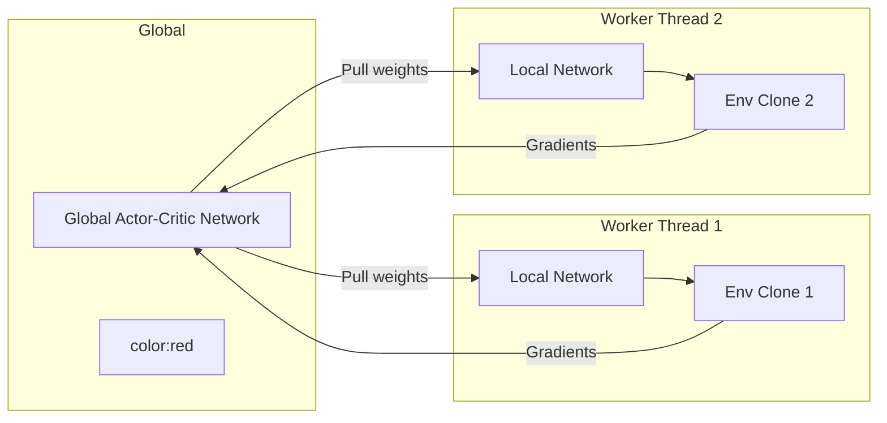

# 🚀 Deep Distributed Era (A2C & A3C)

Merging Deep Learning with distributed environments to solve complex Reinforcement Learning tasks.

## 📌 Concept
Popularized by Mnih et al. in 2016, this era utilized parallel execution threads to sample decorrelated transitions. 
- **A3C (Asynchronous Advantage Actor-Critic):** Independent CPU threads update a global network asynchronously.
- **A2C (Advantage Actor-Critic):** Synchronous version optimizing GPU utilization.

## 📊 Diagram

[⬅️ Back to Main README](../README.md)
