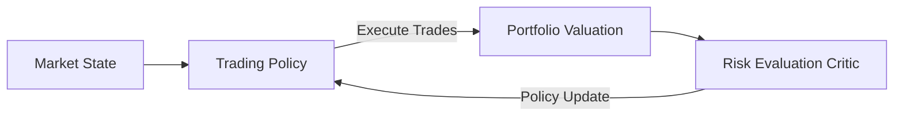

# 📈 High-Frequency Multi-Agent Autonomous Asset Trading

Utilizing multi-agent reinforcement learning for algorithmic trading.

## 📌 Concept
Distributed actor networks decide asset allocation or trades, and the deep critic networks evaluate portfolio risk metrics like covariance and expected drawdown.

## 📊 Diagram

[⬅️ Back to Main README](../README.md)
