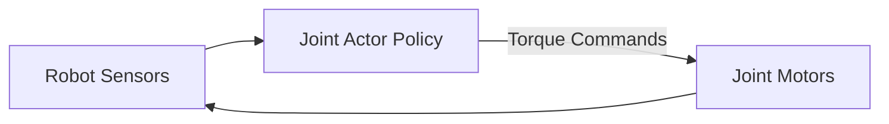

# 🤖 Kinetic Control for Humanoid Robotics

Deploying continuous actor-critic control loops in physical physical engines.

## 📌 Concept
High-frequency control loop where the actor interprets orientation/joint sensors and outputs joint motor torques, while the critic estimates value states based on stability parameters.

## 📊 Diagram

[⬅️ Back to Main README](../README.md)
