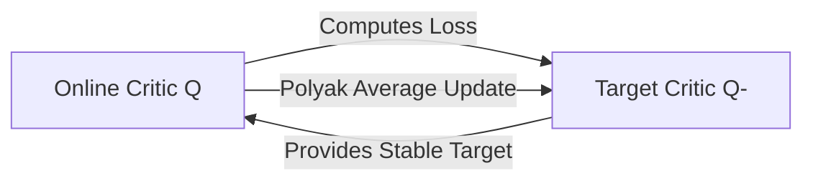

# 🎯 Moving Target Instability & Target Networks

Addressing the feedback loop problem during training.

## 📌 Concept
Since both the actor and critic are updated continuously, the targets for the critic keep shifting. This is solved by using Target Networks (Polyak/Exponential Moving Averages or Periodic Updates) to stabilize the target values.

## 📊 Diagram

[⬅️ Back to Main README](../README.md)
