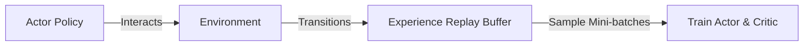

# 💾 Off-Policy Actor-Critic (SAC / DDPG)

Reusing historical transition data for maximum sample efficiency.

## 📌 Concept
Unlike on-policy methods, off-policy actor-critic architectures leverage a large Experience Replay Buffer containing transitions collected by current and older policy parameters.

## 📊 Diagram

[⬅️ Back to Main README](../README.md)
