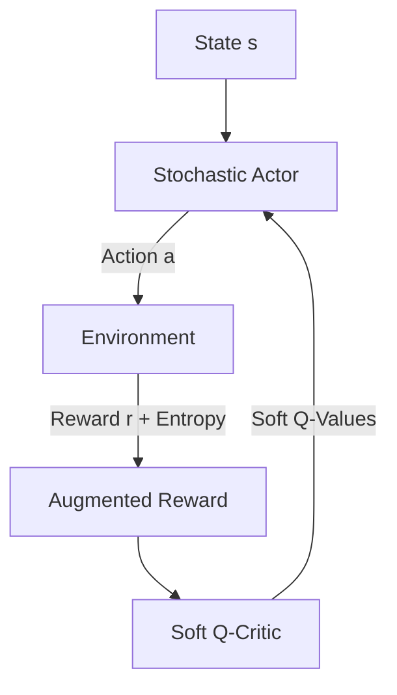

# 🔮 Off-Policy Maximum Entropy (SAC)

The modern gold standard for continuous control and robotics tasks.

## 📌 Concept
Soft Actor-Critic (SAC) incorporates an entropy regularization term into the RL objective. The objective encourages exploration by maximizing the policy's expected reward and its entropy simultaneously.

## 📊 Diagram

[⬅️ Back to Main README](../README.md)
