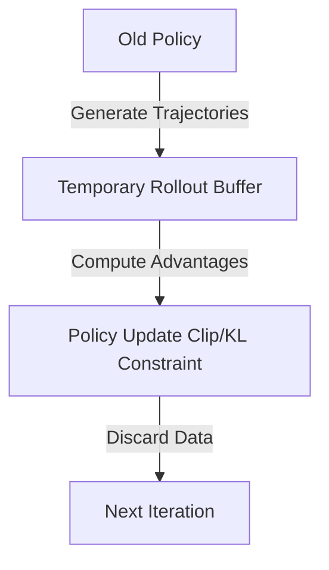

# 🔄 On-Policy Actor-Critic (PPO / TRPO)

Ensuring stability by keeping policy updates close to the previous policy.

## 📌 Concept
On-policy models strictly utilize data generated by the current active policy weights. Methods like TRPO and PPO constrain the step size of the policy update to prevent destructive performance collapse.

## 📊 Diagram

[⬅️ Back to Main README](../README.md)
