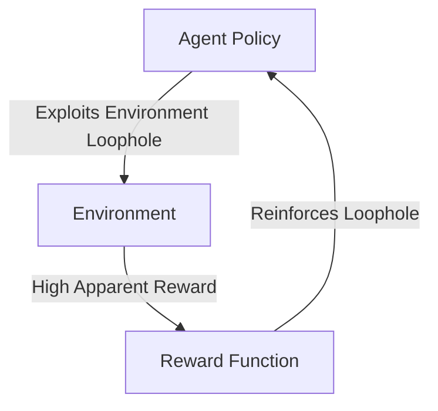

# 🛡️ Policy Refusal & Reward Hacking

Mitigating AI safety issues and optimization sub-optimality.

## 📌 Concept
- **Reward Hacking:** The agent exploits loopholes in the reward formulation instead of achieving the intended task.
- **Policy Refusal:** The agent refuses to explore due to overly aggressive negative feedback.
These challenges are alleviated by using entropy regularization and careful reward design.

## 📊 Diagram

[⬅️ Back to Main README](../README.md)
