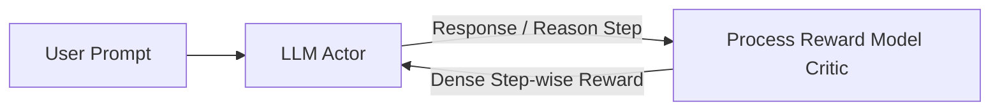

# ✍️ Post-Training RL Alignment for Large Reasoning Models

Applying RL to fine-tune large language models and reasoning agents.

## 📌 Concept
RLHF (Reinforcement Learning from Human Feedback) or RLAIF (from AI Feedback) uses an actor (the LLM generating tokens/reasoning chains) and a critic (reward model or process supervisor) to guide the language model output.

## 📊 Diagram

[⬅️ Back to Main README](../README.md)
