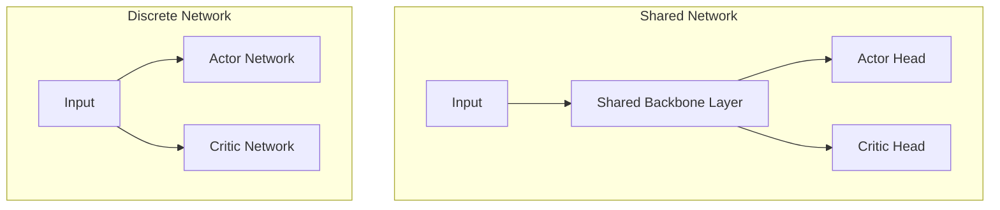

# 🧠 Shared vs. Discrete Parameter Networks

Architectural choices in neural network design for Actor-Critic models.

## 📌 Concept
- **Shared Network:** The Actor and Critic share early layers (e.g., visual feature extractors), branching out only at the output head.
- **Discrete Network:** Completely separate neural network graphs for the Actor and Critic to prevent gradient interference.

## 📊 Diagram

[⬅️ Back to Main README](../README.md)
