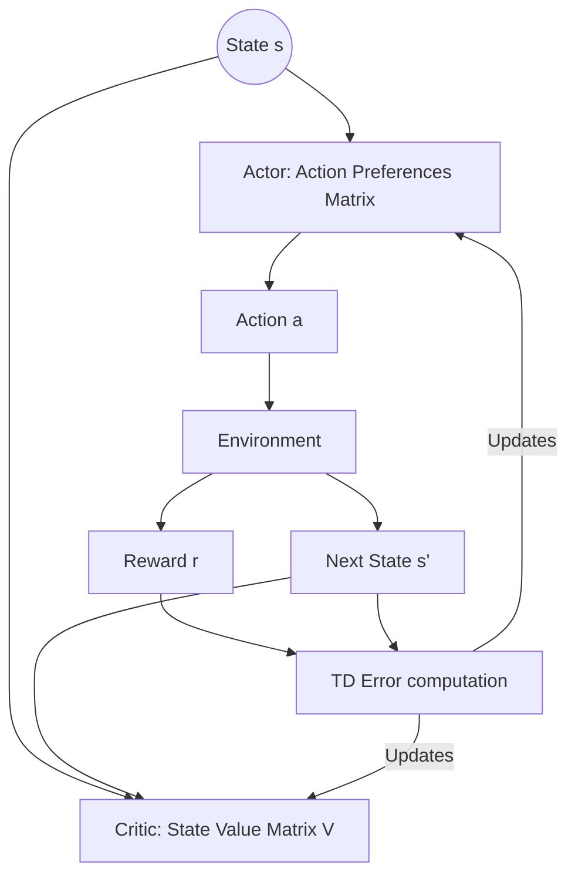

# 🪙 Tabular Actor-Critic Era

The foundational tabular era represents the historical origin of the Actor-Critic paradigm.

## 📌 Concept
First proposed by Barto, Sutton, and Anderson in 1983, it used temporal difference (TD) errors to update a rigid lookup matrix. The Actor stores action preferences, and the Critic tracks state utilities.

## 📊 Diagram

## ⚠️ Limitations
- **Curse of Dimensionality:** Requires discrete state/action representation, making it unusable for continuous tasks or high-dimensional sensory input.

[⬅️ Back to Main README](../README.md)
